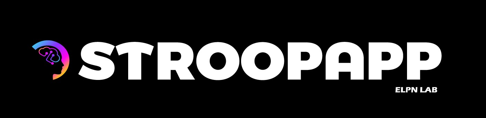

<div align="center">



# **StroopApp**
### *A Modern Desktop Application for Administering Stroop Tasks in Experimental Research*


[Quick Start](#-quick-start) ·
[Documentation](https://github.com/MylanBeghin/StroopApp/wiki) ·
[Download](https://github.com/MylanBeghin/StroopApp/releases) ·
[Report Bug](https://github.com/MylanBeghin/StroopApp/issues) ·
[How to Cite](#how-to-cite)

</div>

---

## 📖 About

**StroopApp** is an open-source Windows desktop application designed to administer Stroop tasks in experimental research contexts, including psychology, cognitive neuroscience, and related fields.

It implements a **visual cues task-switching paradigm** inspired by Mangin et al. (2021, 2022), with a strong focus on experimental rigor, timing precision, and reproducibility.  
The application is designed to be **no-code**, allowing researchers to configure and run experiments without technical setup.

### 🎯 Key features

- Flexible experimental configuration (congruency ratio, number of trials, task-switching rate)
- Visual cues paradigm using shapes (circle = name color, square = read word)
- Millisecond-level reaction time measurement
- Automatic export of detailed results (Excel, trial-by-trial)
- Multilingual interface (English and French)
- Dual-window architecture (experimenter dashboard + participant full-screen view)
- Ready-to-use for research without writing code

### 🎓 Who should use StroopApp?

- PhD students and postdoctoral researchers studying the Stroop effect
- Psychology laboratories investigating cognitive control and interference
- Neuroscience research teams working on task-switching paradigms
- Educators demonstrating the Stroop effect in teaching contexts

---

## 🎬 Demo

Below is a short demonstration of **StroopApp** highlighting the experimenter-side interface and workflow.


<details>
<summary><strong>Screenshots (experimenter interface)</strong></summary>

**Experiment configuration**  
This screen allows the experimenter to define all experimental parameters, including congruency ratio, number of trials, task-switching rate, language, and export settings, through a no-code graphical interface.  


**Experiment monitoring (experimenter view)**  
This window provides real-time monitoring of the running experiment, including current trial status and progression, allowing the experimenter to supervise the session without interfering with the participant’s task.  


</details>

## 🚀 Quick start

### Installation

1. Download the latest **StroopApp.exe** from the [Releases](https://github.com/MylanBeghin/StroopApp/releases) page
2. Launch the executable

StroopApp is distributed as a **self-contained Windows executable**.  
No installation steps, no dependencies, and no .NET runtime are required.

### Basic workflow

```text
1. Launch StroopApp
2. Select the interface language (English or French)
3. Configure the experimental profile (task parameters, trial structure)
4. Select the export directory for experimental results*
5. Verify key mappings used for participant responses
6. Create and select the participant associated with the session
7. Start the experiment
8. Set up the participant window (multi-screen setup)**
9. Monitor experiment progress from the experimenter interface
```
*By default, results are saved in the user’s **Documents** folder.
It is strongly recommended to explicitly select an export directory to ensure that results are stored in a known and easily retrievable location.

**During the experiment, the participant view is displayed in fullscreen **without window borders**, as required for experimental control.
In multi-screen setups, the experimenter must manually position the participant window on the appropriate display before starting the task.

Two methods are available:

* Manual positioning using the mouse
* Windows keyboard shortcuts

Detailed instructions are available in the documentation:
[Participant window setup](https://github.com/MylanBeghin/StroopApp/wiki/Usage#7-participant-window-setup)

### System requirements

* **OS**: Windows 7 or newer (tested on Windows 7, 10, and 11)
* **RAM**: 1 GB recommended
* **Display**: 1280×720 minimum (1920×1080 recommended for dual-screen setups)
* **Storage**: 200 MB available
  
---

## 📚 Documentation

Check documentation on the [Wiki tab](https://github.com/MylanBeghin/StroopApp/wiki)!

---

## How to Cite

**If you use StroopApp in academic work, please cite it.**

### APA Style

```text
Beghin, M., Pageaux, B., Mangin, T.  (2026). StroopApp (Version 1.0.0) [Computer software].
https://github.com/MylanBeghin/StroopApp
```

### BibTeX

```bibtex
@software{beghin_stroopapp_2026,
  author  = {Beghin, Mylan, Pageaux, Benjamin, Mangin, Thomas},
  title   = {StroopApp},
  version = {1.0.0},
  year    = {2026},
  url     = {https://github.com/MylanBeghin/StroopApp}
}
```

A `CITATION.cff` file is provided at the root of the repository for automated citation tools.

### Scientific background

> Mangin, T., André, N., Benraiss, A., Pageaux, B., & Audiffren, M. (2021).  
> *No ego-depletion effect without a good control task.*  
> Psychology of Sport and Exercise, 57, 102033.  
> https://doi.org/10.1016/j.psychsport.2021.102033

> Mangin, T., Audiffren, M., Lorcery, A., Mirabelli, F., Benraiss, A., & André, N. (2022).  
> *A plausible link between the time-on-task effect and the sequential task effect.*  
> Frontiers in Psychology, 13, 998393.  
> https://doi.org/10.3389/fpsyg.2022.998393

---

## Contributing

Contributions are welcome! :blush:

- [Issues](https://github.com/MylanBeghin/StroopApp/issues) are open for bug reports, documentation issues, or feature requests.
- Feel free to open an issue if you encounter a problem or would like to suggest an improvement.
- If you are interested in contributing code or extending the software, please get in touch first.

Research-oriented contributions and feedback are especially appreciated.

---

## License

StroopApp is released under the **MIT License**.
See the [LICENSE](LICENSE) file for full details.

---

## Acknowledgments

I developed this project during a six-month research internship at the **Centre de Recherche de l'Institut Universitaire de Gériatrie de Montréal (CRIUGM)** as a graduate engineering student from the **École Nationale Supérieure de Cognitique (ENSC), Bordeaux INP**.

I would like to thank:
- **CRIUGM** for welcoming me as an international intern and providing an exceptional research environment
- **ENSC, Bordeaux INP** for the education and skills that prepared me to undertake this project

### Special Thanks

**Financial Support:**
- **Prof. Benjamin Pageaux's Laboratory** (CRIUGM) for research scholarship
- **Région Nouvelle-Aquitaine** for mobility grant

**Research Team:**
- **ELPN Lab team** – Thank you for the incredible welcome! Your constant support, positive energy, and warm atmosphere made this internship an unforgettable experience. Working alongside such a welcoming and collaborative team was truly inspiring! 🙏

**Special Recognition:**
- **Benjamin and Thomas** – This experience wouldn't have been possible without you. Thank you for your unwavering support, both professionally and personally, and for always being there whenever I needed guidance or help. Your mentorship made all the difference!
- **Eloïse Coursier** – Thank you for generously creating the beautiful StroopApp logo!

---

## Contact

* **Authors**: Mylan Beghin, Benjamin Pageaux, Thomas Mangin
* **Emails**: [mylan.bghn@gmail.com](mailto:mylan.bghn@gmail.com) (Developer), [thomas.mangin@umontreal.ca](mailto:thomas.mangin@umontreal.ca) (PhD, Post-Doc Researcher)
---

<div align="center">

[Back to Top](#stroopapp)

</div>


