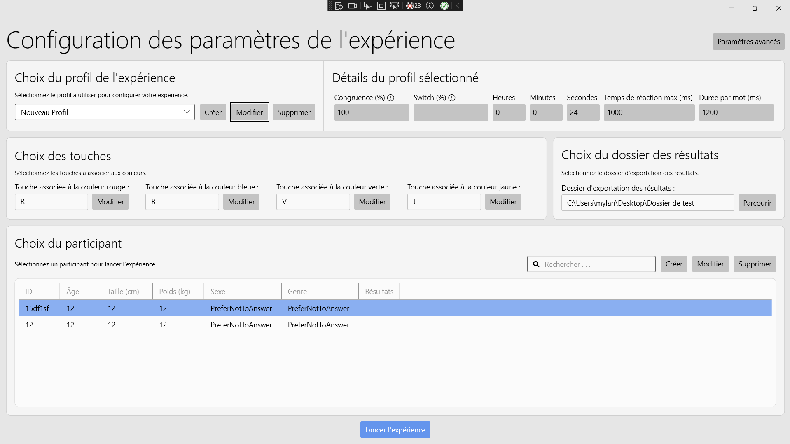
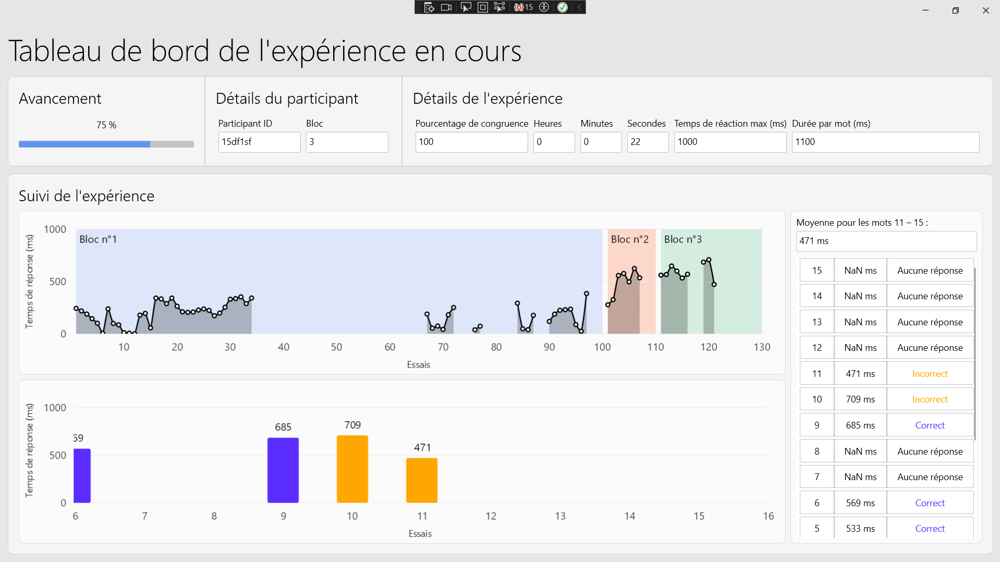

# StroopApp

StroopApp is an open-source application framework based on WPF and .NET for administering Stroop tasks in experimental research.  
It was developed to provide a code-free, easy-to-use, and high-precision tool for measuring response times and exporting clean data in cognitive psychology experiments.

This project is currently in active development and was initiated as part of a final-year engineering internship at [ENSC](https://ensc.bordeaux-inp.fr) (part of [Bordeaux INP](https://www.bordeaux-inp.fr)), in collaboration with the [CRIUGM](https://criugm.qc.ca/).

## Key features

- Stroop task generator (with or without visual cue)
- Precise control of response time measurement
- Code-free configuration and streamlined UI
- Clean .xlsx result export (using ClosedXML)
- MVVM architecture with full business logic coverage (unit tested with xUnit)
- GitHub Actions continuous integration (CI/CD planned)
- Serial port communication in progress (for synchronization with external devices such as MRI)

## Project status

This project is under active development.  
The core software is functional and stable. Unit tests cover all business logic; ViewModel coverage is planned.  
Technical validation (timing accuracy) and user testing sessions are scheduled.

An open-source release is planned, along with submission to the *Journal of Open Source Software (JOSS)*.  

## Screenshots

Here are a few screenshots of StroopApp:

## Technology stack

- .NET 8
- C# / WPF
- MVVM
- xUnit
- ClosedXML
- ModernWPF
- GitHub Actions (CI)

## Licenses and third-party packages

This project relies on several open-source packages:

- [ClosedXML](https://github.com/ClosedXML/ClosedXML) (MIT)
- [CommunityToolkit.Mvvm](https://github.com/CommunityToolkit/dotnet) (MIT)
- [coverlet.collector](https://github.com/coverlet-coverage/coverlet) (MIT)
- [Extended.Wpf.Toolkit](https://github.com/xceedsoftware/wpftoolkit) (MS-PL)
- [FontAwesome5](https://github.com/MartinTopfstedt/FontAwesome5) (MIT)
- [LiveChartsCore.SkiaSharpView.WPF](https://github.com/beto-rodriguez/LiveCharts2) (MIT)
- [ModernWpfUI](https://github.com/Kinnara/ModernWpf) (MIT)
- [Ookii.Dialogs.Wpf](https://github.com/ookii-dialogs/ookii-dialogs-wpf) (MIT)
- [System.IO.Ports](https://github.com/dotnet/runtime) (.NET Foundation MIT)

All these packages are used under permissive licenses compatible with the MIT license.

## Contact

Developer: **Mylan Beghin**  
Internship at: CRIUGM, Montréal  
School: [ENSC – École Nationale Supérieure de Cognitique](https://ensc.bordeaux-inp.fr) – [Bordeaux INP](https://www.bordeaux-inp.fr)  
GitHub: [github.com/MylanBeghin](https://github.com/MylanBeghin)

For questions, collaboration, or academic references, feel free to contact me via GitHub.
